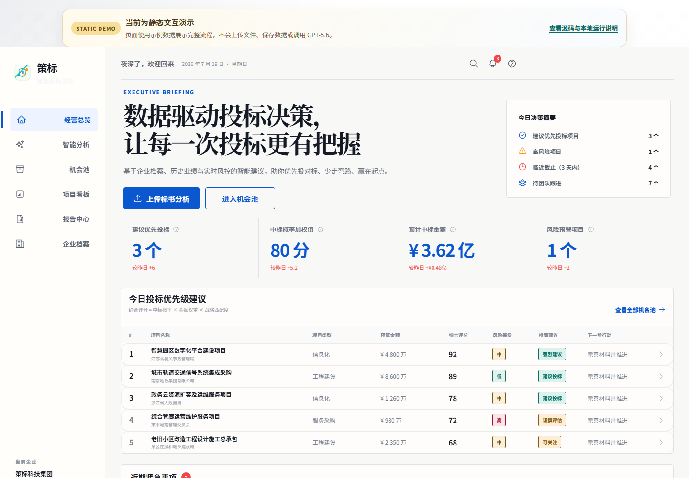
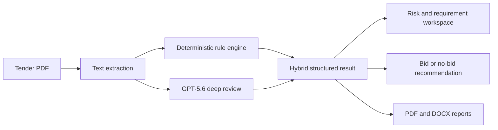

# Bid Strategy

[](https://github.com/kakssjs/toubiaojuece/actions/workflows/ci.yml)

**Bid Strategy** is an AI-assisted tender intelligence workspace that helps teams turn long, complex procurement documents into an actionable bid plan. It combines deterministic business rules with GPT-5.6 analysis so users can review requirements, surface risks, organize evidence, and make a more informed bid/no-bid decision.

[Explore the static interactive showcase](https://kakssjs.github.io/toubiaojuece/) · [View the source repository](https://github.com/kakssjs/toubiaojuece)

> **Demo note:** GitHub Pages is a frontend-only showcase. It uses sample data and fixed example results, and it does not upload files, save private data, or call GPT-5.6. Run the full application locally or deploy the Django backend to exercise the real analysis pipeline.



## What it does

- Imports tender documents and extracts text from PDFs.
- Uses a hybrid analysis pipeline to identify requirements, risks, deadlines, scoring factors, and evidence gaps.
- Matches tender requirements against a company profile and reference materials.
- Produces structured recommendations while preserving a deterministic fallback when AI is unavailable.
- Organizes opportunities, project tasks, team ownership, reminders, and progress in one workspace.
- Exports analysis results as professional PDF and DOCX reports.
- Supports authenticated, user-scoped project data and deployment-ready storage/database integrations.

## How it works



The backend first creates a reproducible baseline with local rules. When an OpenAI API key is configured, the same tender is reviewed by GPT-5.6 through the OpenAI Responses API. The model response is constrained by a JSON schema, validated, and merged with the baseline. If the AI request is disabled or unavailable, the application still returns the deterministic result instead of blocking the workflow.

## How Codex was used

Codex was the primary engineering collaborator during the project. We used it throughout the build—not just for a one-time code generation step—to:

- translate the product idea into a Django and Vue architecture;
- design and refine the opportunity dashboard and tender-review workflow;
- implement API endpoints, data models, authentication, task management, and report export;
- build the PDF ingestion and hybrid AI-analysis pipeline;
- add automated tests for analysis, parsing, security, account access, projects, tasks, reports, and storage;
- investigate integration issues and improve fallback/error handling;
- prepare the Vercel deployment and GitHub Pages showcase;
- review the repository for secrets and prepare the public Devpost submission.

Codex accelerated iteration across product design, frontend, backend, testing, and deployment. We reviewed the generated changes, tested the important user paths, and kept deterministic safeguards around model-dependent features.

## How GPT-5.6 was used

GPT-5.6 powers the optional deep-review layer in the Django application. The default model is configured as `gpt-5.6` through `OPENAI_ANALYSIS_MODEL`. The public GitHub Pages showcase never calls the model; the integration runs only when the backend is deployed and explicitly configured with an API key.

It is used to:

- interpret tender language in context rather than relying only on keyword matching;
- return structured requirements, risks, insights, evidence gaps, and recommendations;
- improve bid/no-bid decision support by comparing the tender with the company profile;
- process scan-heavy PDFs through the OpenAI vision-capable Responses API fallback;
- produce schema-constrained JSON that the Django application can validate and merge safely.

The integration is implemented in [`tenders/agents/openai_tender_analysis_agent.py`](tenders/agents/openai_tender_analysis_agent.py), with PDF vision fallback in [`tenders/services/pdf_parser.py`](tenders/services/pdf_parser.py). No fine-tuning or hidden training data is required, and API keys are read only from environment variables.

## Built with

- Python 3.12 and Django
- Vue 3, Vite, and JavaScript
- OpenAI Responses API and GPT-5.6
- `pypdf` for PDF text extraction
- ReportLab and `python-docx` for report generation
- PostgreSQL, MySQL, or SQLite
- Vercel and Vercel Blob
- GitHub Pages

## Repository structure

```text
bid_agent/       Django project configuration
tenders/         Domain models, APIs, analysis agents, services, and tests
frontend/        Vue 3 application and workspace UI
api/             Vercel serverless helpers
assets/          Compiled assets used by the public GitHub Pages demo
index.html       Public showcase entry point
```

The readable application source is included in `bid_agent/`, `tenders/`, `frontend/`, and `api/`. The compiled files at the repository root power the public showcase.

## Run locally

### 1. Backend

```bash
python -m venv .venv
# Windows: .venv\Scripts\activate
# macOS/Linux: source .venv/bin/activate
pip install -r requirements.txt
copy .env.example .env
python manage.py migrate
python manage.py runserver
```

On macOS or Linux, use `cp .env.example .env` instead of `copy`.

### 2. Frontend

```bash
cd frontend
npm install
npm run dev
```

The application can run without OpenAI by leaving `OPENAI_ANALYSIS_ENABLED=0`. To enable the GPT-5.6 review layer, set the following values in your local `.env` file:

```dotenv
OPENAI_API_KEY=your-api-key
OPENAI_ANALYSIS_ENABLED=1
OPENAI_ANALYSIS_MODEL=gpt-5.6
```

Never commit your `.env` file or API keys.

## Tests

```bash
python manage.py test
node --test frontend/src/workspace/*.test.js
```

The same build and test suite runs automatically for every push and pull request through [GitHub Actions](.github/workflows/ci.yml).

## Inspiration and lessons

Tender teams often spend hours moving between PDFs, spreadsheets, chat messages, and document templates before they can even decide whether an opportunity is worth pursuing. Bid Strategy was inspired by the idea that AI should reduce that coordination burden while keeping the final decision explainable and under human control.

The biggest lesson was that model output is most useful when it sits inside a reliable product system. Combining GPT-5.6 with schema validation, deterministic analysis, user-scoped data, visible evidence, and graceful fallbacks made the experience much more dependable than an unconstrained prompt alone.

## What's next

- Add richer collaborative review and approval workflows.
- Expand evidence matching across reusable company knowledge bases.
- Improve multilingual and scanned-document extraction.
- Add evaluation datasets for measuring extraction and recommendation quality.
- Introduce configurable scoring models for different industries and procurement frameworks.

## Responsible use

Bid Strategy provides decision support, not legal, financial, or procurement advice. Users should verify tender requirements and final submissions against the original source documents.
